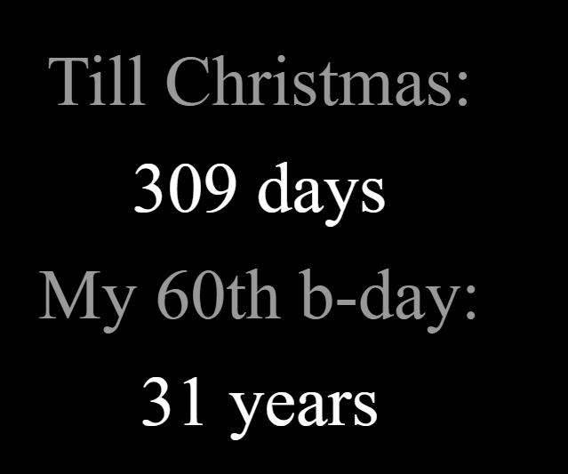

# MMM-CountDown
Create a simple countdown. 

# MMM-CountDown



Count down to a date and time

## Installation

### Install

In your terminal, go to your [MagicMirror²][mm] Module folder and clone MMM-CountDown:

```bash
cd ~/MagicMirror/modules
git clone https://github.com/davi2206/MMM-CountDown
```

### Update

```bash
cd ~/MagicMirror/modules/MMM-CountDown
git pull
```

## Using the module

To use this module, add it to the modules array in the `config/config.js` file:

```js
    {
        module: 'MMM-CountDown',
        position: 'lower_third',
        config: {
            counters: [
                {
                    targetDate: '30-09-2025',
                },
            ]
        }
    },
```

Or use all the options:
```js
    {
        module: 'MMM-CountDown',
        position: 'lower_third',
        config: {
            counters: [
                {
                    title: 'My Count Down',
                    targetDate: '30-09-2025',
                    targetTime: '23:59',
                    countdownUnit: 'minutes',
                    showUnit: false,
                },
            ]
        }
    },
```


## Configuration options

Option          |Type      |Possible values                                     |Default      |Description
----------------|----------|------------------------------                      |------       |-----------
`title`         |`string`  |Any text                                            |empty        |The title to show above a counter
`targetDate`    |`string`  |Date in format dd-mm-yyyy                           |n/a          |Required. The date to count down to
`targetTime`    |`string`  |Time in 24 hour format: HH:mm                       |'00:00'      |The time of day to count down to
`countdownUnit` |`string`  |seconds, minutes, hours, days, weeks, months, years |'minutes'    |The unit to count down
`showUnit`      |`boolean` |true or false                                       |false        |Weather to show the unit after the number

## Developer commands

- `npm install` - Install devDependencies like ESLint.
- `npm run lint` - Run linting and formatter checks.
- `npm run lint:fix` - Fix linting and formatter issues.

[mm]: https://github.com/MagicMirrorOrg/MagicMirror
